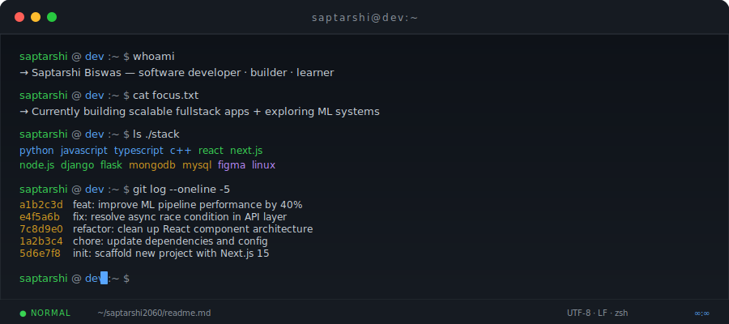

<div align="center">



</div>

<br/>

<div align="center">



</div>

<br/>
<br/>

<div align="center">

```
┌─────────────────────────────────────────────────────────────────────┐
│                                                                     │
│   saptarshi@dev:~ $ cat whoami.txt                                  │
│                                                                     │
│   → I build things.                                                 │
│   → Full stack developer from India, obsessed with clean code       │
│     and elegant systems.                                            │
│   → Somewhere between "it works on my machine" and production.      │
│   → Currently shipping ideas, breaking things, fixing them.         │
│   → Coffee:code ratio — critically high.                            │
│                                                                     │
└─────────────────────────────────────────────────────────────────────┘
```

</div>

<br/>

<div align="center">

</div>

<br/>

<div align="center">



</div>

<br/>

<div align="center">

</div>

<br/>

<div align="center">

```
~/workspace
```

</div>

<br/>

<div align="center">

| layer | tools |
|:------|:------|
| `language` | Python · JavaScript · TypeScript · C++ · HTML5 · CSS3 |
| `frontend` | React · Next.js · Bootstrap |
| `backend` | Node.js · Express.js · Django · Flask |
| `database` | MongoDB · MySQL |
| `tooling` | Git · GitHub · VS Code · Linux · Figma |
| `currently` | Building ML pipelines · Exploring systems design |

</div>

<br/>

<div align="center">


</div>

<br/>

<div align="center">

</div>

<br/>

<div align="center">



</div>

<br/>

<div align="center">

</div>

<br/>

<div align="center">

```
~/activity
```

</div>

<br/>

<div align="center">

<a href="https://github.com/Saptarshi2060">
  
  
</a>

</div>

<br/>

<div align="center">

<a href="https://github.com/Saptarshi2060">
  
</a>

</div>

<br/>

<div align="center">

</div>

<br/>

<div align="center">

```
~/contributions
```

</div>

<br/>

<div align="center">

<picture>
  <source media="(prefers-color-scheme: dark)" srcset="https://raw.githubusercontent.com/Saptarshi2060/Saptarshi2060/output/github-contribution-grid-snake-dark.svg"/>
  <source media="(prefers-color-scheme: light)" srcset="https://raw.githubusercontent.com/Saptarshi2060/Saptarshi2060/output/github-contribution-grid-snake.svg"/>
  
</picture>

</div>

<br/>

<div align="center">

[](https://github.com/Saptarshi2060)

</div>

<br/>

<div align="center">

</div>

<br/>

<div align="center">

```
~/coffee
```

</div>

<br/>

<div align="center">

<table border="0" cellpadding="0" cellspacing="0">
  <tr>
    <td align="center" width="50%">
      
    </td>
    <td align="left" width="50%" valign="middle">

```
daily.routine
─────────────────────────
06:00  wake up (reluctantly)
06:30  coffee #1 — mandatory
07:00  git pull --world
09:00  deep work mode ON
12:00  coffee #2 — non-negotiable
13:00  squash bugs, ship features
16:00  review PRs, sip coffee
18:00  side projects / learning
21:00  read / think / plan
23:00  coffee #∞ (bad decision)
00:00  one more commit...
02:00  finally sleep
```

  </td>
  </tr>
</table>

</div>

<br/>

<div align="center">

</div>

<br/>

<div align="center">

</div>

<br/>

<div align="center">

```
~/currently
```

</div>

<br/>

<div align="center">

```python
class Saptarshi:

    def __init__(self):
        self.name        = "Saptarshi Biswas"
        self.location    = "India"
        self.role        = "Software Developer"
        self.focus       = ["Full Stack Dev", "Machine Learning", "Systems Design"]
        self.learning    = ["Advanced ML pipelines", "Rust", "Distributed systems"]
        self.building    = "Something interesting — check back soon."
        self.open_to     = ["Collaborations", "Open Source", "Side Projects"]
        self.coffee      = float("inf")

    def philosophy(self) -> str:
        return (
            "Write code that a stranger could read at 2am "
            "and understand in 30 seconds."
        )

    def reach_me(self) -> dict:
        return {
            "github":   "github.com/Saptarshi2060",
            "linkedin": "linkedin.com/in/saptarshi-biswas-701813202",
        }

    def __repr__(self) -> str:
        return f"Developer(name={self.name!r}, vibe='nonchalant·precise')"
```

</div>

<br/>

<div align="center">

</div>

<br/>

<div align="center">

```
~/setup
```

</div>

<br/>

<div align="center">

```
┌──────────────────────────────────────────────────────────────────┐
│                                                                  │
│   hardware  ──────────────────────────────────────────────────  │
│   machine      laptop — whatever gets the job done              │
│   display      the one that doesn't hurt my eyes at 2am         │
│   audio        lofi · jazz · ambient · silence (cycling)        │
│                                                                  │
│   software  ──────────────────────────────────────────────────  │
│   editor       VS Code — minimal theme, max focus               │
│   terminal     zsh + oh-my-zsh + starship prompt                │
│   font         JetBrains Mono (ligatures on)                    │
│   theme        dark. always dark.                               │
│   browser      Firefox + uBlock Origin                          │
│                                                                  │
│   workspace ──────────────────────────────────────────────────  │
│   vibe         coffee shop or 2am silence                        │
│   music        lofi hip hop - beats to code to                  │
│   snacks       coffee beans, technically                         │
│   light        dim. very dim.                                   │
│                                                                  │
└──────────────────────────────────────────────────────────────────┘
```

</div>

<br/>

<div align="center">

</div>

<br/>

<div align="center">

```
~/music
```

</div>

<br/>

<div align="center">

[](https://open.spotify.com/user/)

</div>

<br/>

<div align="center">

```
now playing  ──────────────────────────────────────────────────────
genre        lofi hip hop · ambient · jazz · synthwave
mood         focused · caffeinated · slightly chaotic
volume       just loud enough to drown out distractions
playlist     "3am debugging session"  ←  probably this one
```

</div>

<br/>

<div align="center">

</div>

<br/>

<div align="center">

</div>

<br/>

<div align="center">

```
  ██████╗  ███████╗ ██╗   ██╗
  ██╔══██╗ ██╔════╝ ██║   ██║
  ██║  ██║ █████╗   ██║   ██║
  ██║  ██║ ██╔══╝   ╚██╗ ██╔╝
  ██████╔╝ ███████╗  ╚████╔╝
  ╚═════╝  ╚══════╝   ╚═══╝

  [ software developer · india ]
  [ full stack · ml · open source ]
```

</div>

<br/>

<div align="center">

</div>

<br/>

<div align="center">

```
~/philosophy
```

</div>

<br/>

<div align="center">

```
┌─────────────────────────────────────────────────────────────────┐
│                                                                 │
│   "Any fool can write code that a computer can understand.      │
│    Good programmers write code that humans can understand."     │
│                                                                 │
│                                   — Martin Fowler               │
│                                                                 │
├─────────────────────────────────────────────────────────────────┤
│                                                                 │
│   "The best error message is the one that never shows up."      │
│                                                                 │
│                                   — Thomas Fuchs                │
│                                                                 │
├─────────────────────────────────────────────────────────────────┤
│                                                                 │
│   saptarshi's addition:                                         │
│                                                                 │
│   "Ship it. Iterate. Never apologize for working software."     │
│                                                                 │
└─────────────────────────────────────────────────────────────────┘
```

</div>

<br/>

<div align="center">

[](https://github.com/piyushsuthar/github-readme-quotes)

</div>

<br/>

<div align="center">

</div>

<br/>

<div align="center">

```
~/contact
```

</div>

<br/>

<div align="center">

[](https://github.com/Saptarshi2060)
&nbsp;&nbsp;
[](https://www.linkedin.com/in/saptarshi-biswas-701813202/)
&nbsp;&nbsp;
[](https://github.com/Saptarshi2060)

</div>

<br/>

<div align="center">

```
feel free to reach out.
i don't bite.   (the coffee might though.)
```

</div>

<br/>

<div align="center">

</div>

<br/>

<div align="center">


&nbsp;

&nbsp;


</div>

<br/>

<div align="center">

</div>

<br/>

<div align="center">

```
// made with obsessive attention to detail and too much coffee
// last updated by GitHub Actions
// Saptarshi2060 · India · 2026
```

</div>
